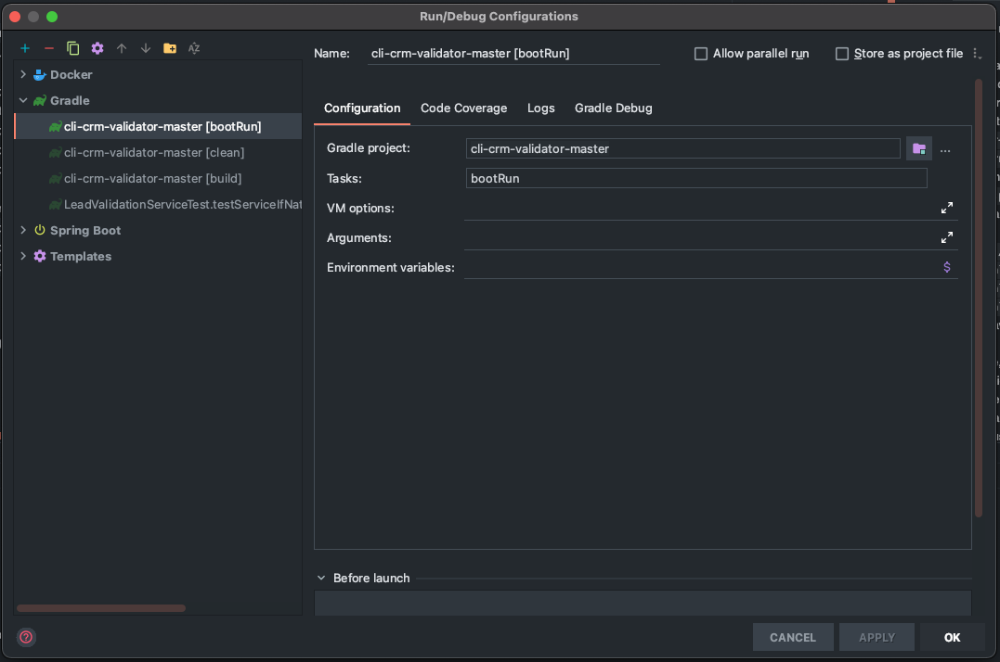
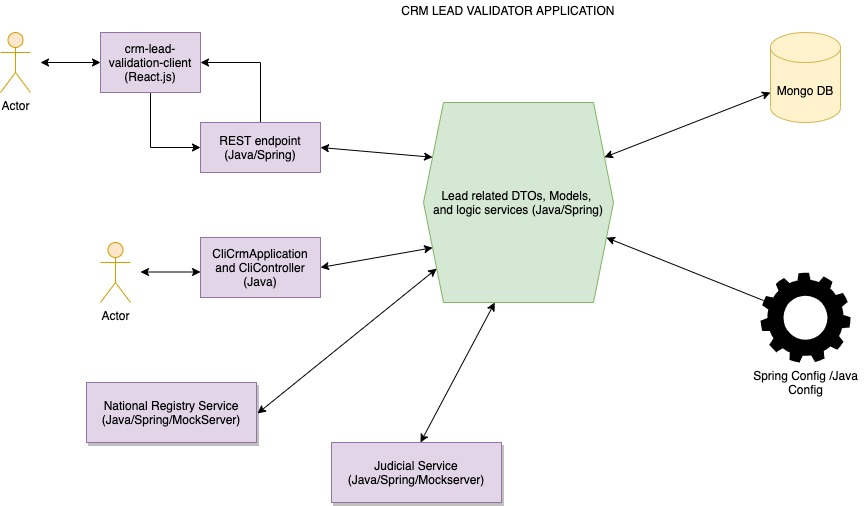
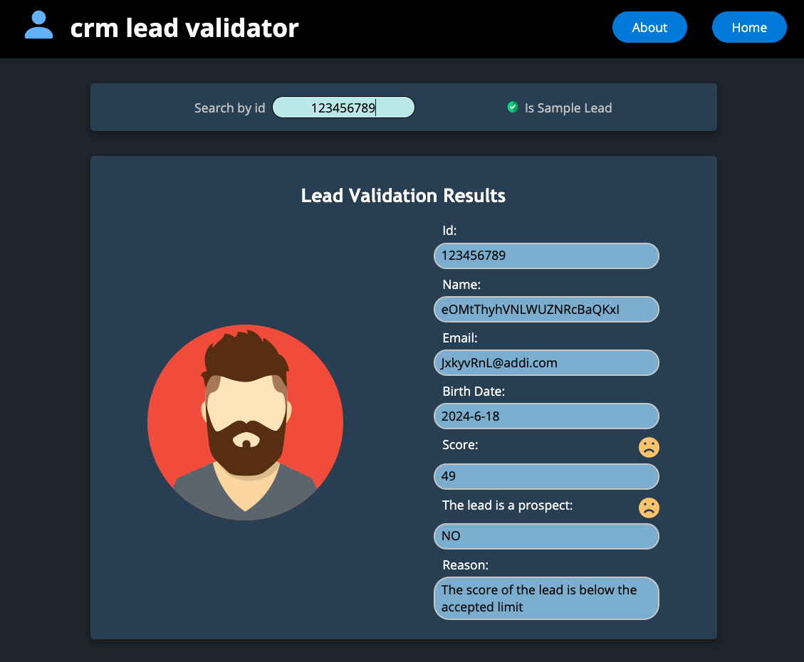

## CRM lead validator:
Elaborated by Ivan David Galvis Sandoval

GitHub of this repo: `https://github.com/davidgalvis95/crm-validator`

### **Terms to take into account:**

* A `Sample Lead` is an id that will be validated using mocked services, in this case the national and judicial service will be replaced by `MockServer` 
* If you select a `Not Sample Lead`, please be sure that you have run this command before `docker-compose up -d external_service` because internally, if the lead is not a sample, and the service will try to reach to the real national and judicial services through feign clients, which will fail because of that.

### **How to run the application and its dependencies:**

1) Stand over the root directory of the project `/cli-crm-validator-master`
2) If you just want to run all the integration of the services (with `docker`, except the UI react.js client) you will need to stand over the root repository and execute the following command: `docker-compose up`
3) Run the following command in your terminal `docker-compose up -d mongodb_container` to start the Mongo DB, which is needed for this project.
4) **Optional:** If you want to use the real National Service and the real Judicial Service then run `docker-compose up -d external_service`, this is another `java/spring` service, which can be found here: `https://github.com/davidgalvis95/crm-lead-validator-external-service` 
5) Once the steps 1 and 2 are completed you can run this service by following the instructions in the step 5 (using `Intellij` and **recommended**). Or if you prefer the command, then `./gradlew bootRun` in the root directory.
6) **Optional but a good suggestion:** If you have `node` and installed in your machine, you can run the UI client that has been created specifically for this project using `React.js`: `https://github.com/davidgalvis95/crm-lead-validator-UI-client`, go to the repository and follow the instructions on its `README.md` (it runs in `http://localhost:3000/` and is launched with `npm start`), it is pretty simple to use (**remember to have this API and its dependencies running before running the custom client**). If you do not want to use that option you can reach this service through a client like postman, or by CLI.
7) If your option was to do it using the `CLI` you should go to your IDE, in this case the project was built with `Intellij`, so go there and select the `Run/Debug configurations` and fill up the required fields as follows: 
8) If your intention is to use it through the `REST` endpoint then, just run the service using any of the already described ways in the steps 4 and 6.

### **Architecture**

The application is basically composed of 3 independent components, following the hexagonal architecture pattern, the application component, the domain one and the infrastructure one, as it can be seen in the structure of the project and its dependencies (Mongo DB, external services, configuration, UI client, CLI controllers)
The architecture of the application is shown in the next image:

### **Custom UI Client**

In case you are interested in using the UI client that has been created for this project exclusively, here is an image of how it does look:

